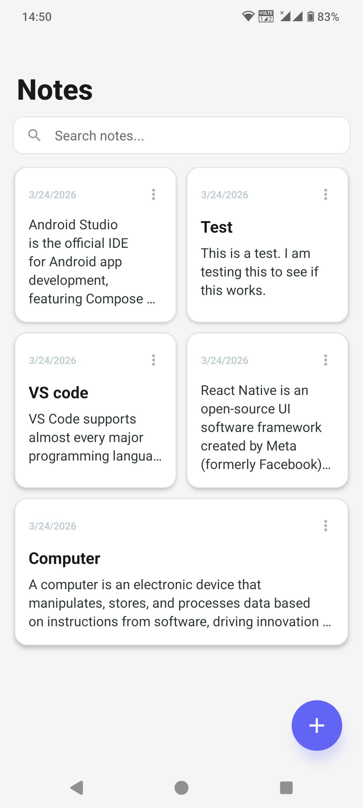
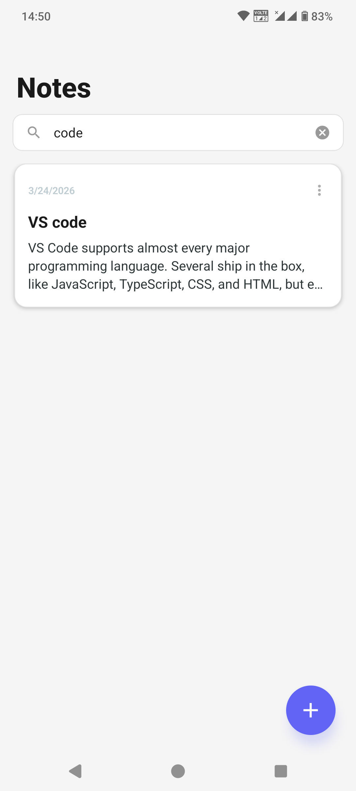
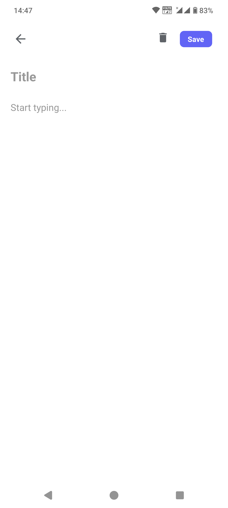

# NotesApp - React Native App

## Project Description

NotesApp is a note-taking mobile application built using React Native and Expo. It allows users to create, edit, and delete notes. The app uses local storage to save notes so that they remain available even after closing the application.

## Features

- Full CRUD Operations: Create, Read, Update, Delete notes
- Search Functionality: Quickly filter through notes by title or content
- Persistent Storage: Data stays saved after app restarts using AsyncStorage
- Responsive 2-column grid layout
- Automatic timestamps on notes

## Tech Stack

- **Framework:** React Native (Expo)
- **Language:** JavaScript (ES6+)
- **Storage:** AsyncStorage
- **Icons:** Expo Vector Icons (MaterialCommunityIcons)

## Setup Instructions

### Prerequisites

* Node.js installed
* Expo Go app on mobile device

### Installation

1. Clone the repository:

```bash
git clone https://github.com/your-username/your-repo-name.git
cd your-repo-name
```

2. Install dependencies:

```bash
npm install
```

3. Start the app:

```bash
npx expo start
```

4. Run the app:

* Scan QR code using Expo Go
* Or run on emulator

## Screenshots

### Home Screen
Displays the 2-column grid and floating action button.


### Search Functionality
Filtering notes in real-time by title and content.


### Add & Edit Note
The full-screen editor for creating and updating notes.
